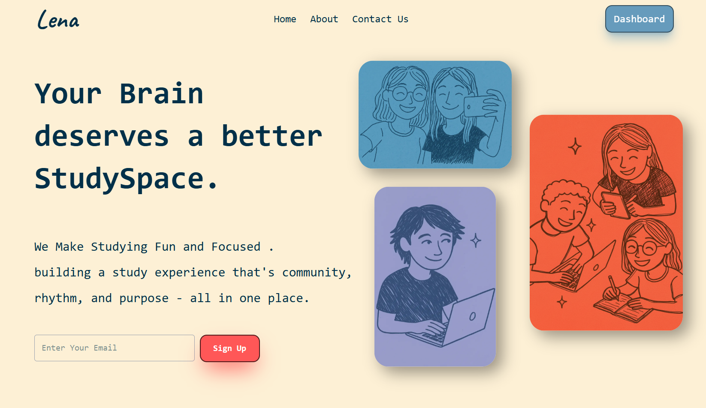
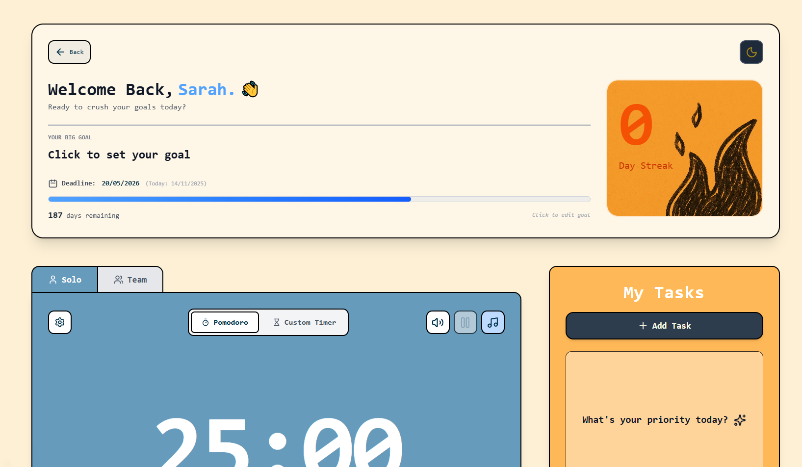

# 💡 Lena
Modern focus and productivity platform with Pomodoro timers, demo real-time collaboration, ambient sounds, task management, and goal tracking.

---

## 🔗 Live Demo
https://lena-sandy.vercel.app/

---

## 📸 Screenshots

---

## ✨ Features
- Customizable Pomodoro & stopwatch timers
- demo Real-time collaborative study sessions
- Ambient sound mixer (rain, waves, forest, etc.)
- Task management with expandable notes
- Goal tracking with streak visualization
- Smooth GSAP scroll animations
- Fully responsive design
- Glassmorphism UI

---

## 🛠️ Tech Stack
- **React**
- **Next.js**
- **TypeScript**
- **Redux Toolkit**
- **GSAP**
- **Framer Motion**
- **Tailwind CSS**

-------------------
