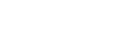

  <!-- Replace with your project banner/logo -->
  

  <h1>🌿 Lena</h1>

  

    <em>Your Digital Sanctuary...</em>
  

  

    <a href="">View Live Demo</a> &nbsp;·&nbsp;
    <a href="">
       
      View Showcase Video on Youtube
    </a>
  

  <!-- Badges -->
  

    
    
    
    
    
    
  

---

<!-- SCREENSHOTS / PREVIEW -->
## 📸 Preview

<!-- Visuals talk louder than code. Lena is about focus and light. -->

  
  
  

---

<!-- TABLE OF CONTENTS -->
## 📋 Table of Contents

- [About The Project](#-about-the-project)
- [AI-Guided Workflow](#-ai-guided-workflow)
- [Tech Stack](#-tech-stack)
- [Direction](#-direction)
- [Features](#-features)
- [Lessons Learned](#-lessons-learned)
- [Roadmap](#-roadmap)
- [Contact](#-contact)
- [License](#-license)

---

<!-- ABOUT THE PROJECT -->
## 🎯 About The Project

### Problem & Solution Statement
Most productivity tools today feel like clinical spreadsheets—overly practical, intimidating, and disconnected from how people actually feel. They focus so much on "getting things done" that they forget the human need for a peaceful, supportive environment. 

As a student who constantly struggled with distractions and the heavy pressure of studying, I realized we needed something different. We didn't need another app acting like a strict boss; we needed a safe space.

**Lena** was built to bridge this gap. Created *by a student, for all students*, it is a digital sanctuary designed to turn your screen into a focused, breathable workspace. It’s a "safe space" that doesn't demand anything extra from you or overwhelm you. Instead, it invites you to quiet the noise, enter your flow state effortlessly, and get things done without the mental burden.

### Key Highlights

- **From Student to all Students:** Born out of real struggles with focus and distractions, perfectly tailored for Gen Z students, yet deeply beneficial for anyone looking to calm their nerves while working.
- **Playful yet Disciplined:** A delicate balance of being fun, relaxing, and aesthetic, while still providing the powerful features needed for deep focus and discipline.
- **Aesthetic First:** Heavily inspired by Neo-brutalism and artistic minimalism. Lena uses a unique palette with fun, vibrant accents to reduce eye strain, promote calm, and make the space feel genuinely inviting rather than clinical.
- **Solo-Led Vision & Dev:** From the initial "Space" concept to the advanced GSAP animations, every detail was carefully curated and coded by me to ensure a cohesive, human-centered experience.

---

<!-- DIRECTION -->
## 🎨 Direction

> **"Lena" is more than a name; it's a commitment to clarity, comfort, and zero-pressure productivity.**

### Vibes & Mood

The core vision for Lena was to create a "Paper Sanctuary." In a world of over-saturated blue light and jarring UI, Lena takes inspiration from physical stationery and calm, artistic spaces. It’s designed for those who want their browser to feel as comfortable as a quiet room at twilight. 

The copywriting, animations, and overall vibes all converse together to whisper: *"Take a deep breath, you're safe here, let's get into the zone."*

  
  

### Color Palette

The colors were chosen to evoke "Dusty Elegance" and "Deep Focus," striking the perfect balance between playful, fun, and relaxing.

| Color | Hex | Usage |
|-------|-----|-------|
| Papyrus Cream | `#FDF0D5` | The primary background — soft on the eyes, organic, and grounding. |
| Prussian Blue | `#003049` | Deep, high-contrast typography for ultimate readability and discipline. |
| Sky Blue | `#669BBC` | Primary accent for active UI elements, adding a dynamic and playful layer. |
| Muted Coral | `#ff8b8b` | Soft highlights to identify priority tasks without inducing anxiety or stress. |

### Target Audience
Lena’s primary audience is those who want a visually pleasing, fun, and distraction-free zone to study and produce their best work. However, the core philosophy of a "calm productivity space" makes it perfect for the "Digital Hermit" (developers, writers, or designers) or anyone who values the *mental well-being* of their workflow and just wants to calm down and work.

---

<!-- AI-GUIDED WORKFLOW -->
## 🤖 AI-Guided Workflow

> AI acted as a pair-programmer and a creative sounding board throughout Lena's development.

| Area | Tool | How I Used It |
|------|------|---------------|
| **Programming & Logic** | Antigravity | Pair-programming for building complex GSAP timelines, managing state logic, and overall frontend architecture. |
| **Copywriting, Imagery and research** | ChatGPT | Brainstorming slogans, crafting the "Sanctuary" brand voice, and assisting with conceptual imagery. |

---

<!-- TECH STACK -->
## 🛠 Tech Stack

| Category | Technology |
|----------|-----------|
| **Framework** | Next.js 16 (App Router) |
| **UI Library** | React 19 |
| **Animations** | GSAP 3 |
| **Styling** | Tailwind CSS 4 |
| **State Management** | Redux Toolkit |
| **Smooth Scroll** | Lenis |
| **Audio Engine** | Howler.js |
| **Icons** | Lucide React |

---

<!-- FEATURES -->
## ✨ Features

### ✨ Key Features

- **The Space Dashboard:** A dedicated, distraction-free route designed to act as your calm digital home base for deep focus.
- **Goal Streak Tracking:** High-impact visual progress widget for tracking habits and deadlines, helping you stay disciplined without feeling overwhelmed.
- **Immersive Pomodoro Timer:** A fully customizable focus timer. Features a distraction-free "Zen Mode" that expands into full-screen with a breathing, animated soft background.
- **Smart Todo & Notes:** An interactive daily task manager Includes a mini-notepad to capture stray ideas without breaking your flow.
- **Ambient Soundscape:** Integrated audio controls to layer white noise, rain over your session, instantly tuning out the real world.
- **Fully Responsive Sanctuary:** A flawless experience across mobile and desktop, ensuring your focus follows you everywhere.

---

<!-- LESSONS LEARNED -->
## 🧗 Lessons Learned

🧠 Creative Philosophy

- **Vibe over Utility:** I learned that a tool people *love* using is more effective than a tool they *have* to use. Design is not a luxury; it's a driver for productivity.
- **The Solo Journey:** Handling everything from branding to deployment taught me how to maintain a consistent vision across multiple disciplines.

💻 Technical Growth

- **Advanced Motion Design:** Working with GSAP timelines taught me the importance of orchestration—ensuring every element enters and exits the stage with purpose.
- **Scalable Architecture:** Moving to Next.js 16 and Redux Toolkit mid-project was a masterclass in refactoring and codebase management.

---

<!-- ROADMAP -->
## 🗺 Roadmap
You can consider The current version of Lena as MVP. The core philosophy of this project is ultimate personalization—allowing users to mold the space precisely how they need it. Here’s what’s next on the horizon:
- [ ] **Backend Integration:** Implementing a robust backend to save your personal metrics, goals, and customizations across multiple devices.
- [ ] **Full Collab Mode Activation:** Bringing the real-time "Team Session" to life, so you can study alongside your friends, mirroring the quiet accountability of a college library.
- [ ] **Custom Sound Uploads:** Allow users to upload or link their own focus tracks to blend with the built-in soundscapes.
- [ ] **Multi-language Support:** Expanding the sanctuary to even more students worldwide.

---

<!-- CONTACT -->
## 📬 Contact
Phone: 01147513119

Email: mosaeed162005@gmail.com

LinkedIn: https://www.linkedin.com/in/mohamed-saeeed-609451317/

Upwork: https://www.upwork.com/freelancers/~01c5b6713470336779

**Mohamed Saeed Attia**

  
  
  
  

**Project Link:** [(https://lena-sandy.vercel.app/)](https://lena-sandy.vercel.app/)

---

  
Built from a student for all students❤️. <a href="">Mohamed Saeed</a>

